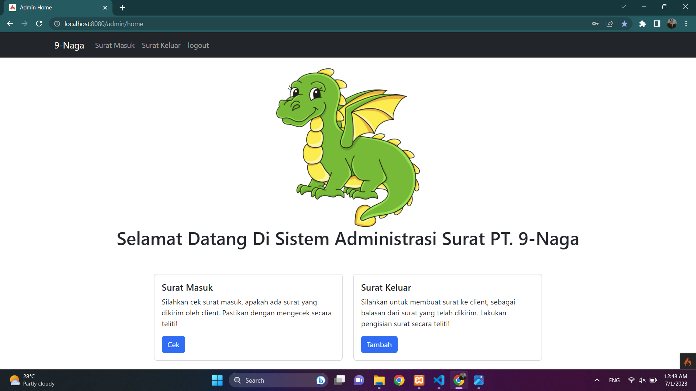
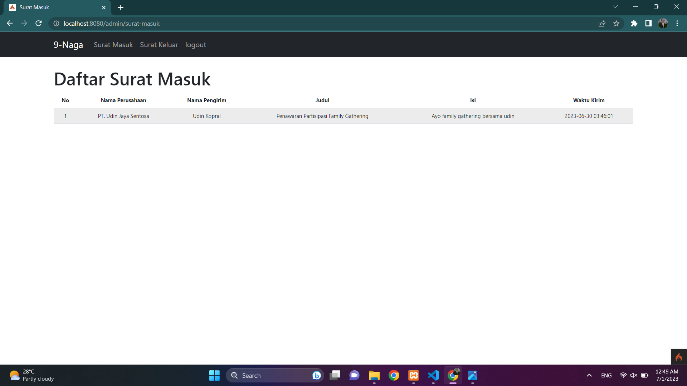
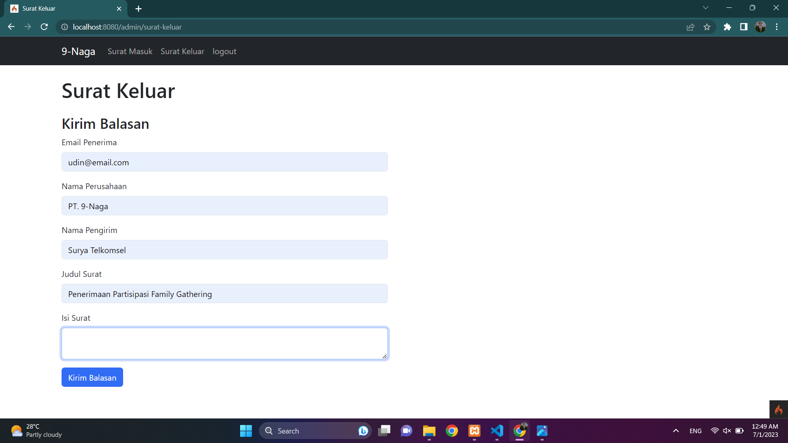
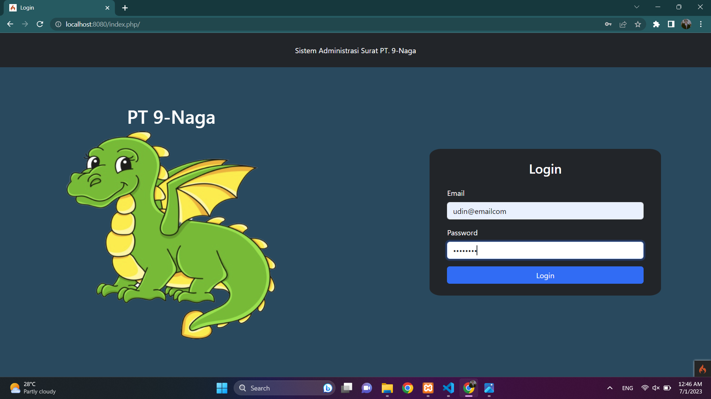
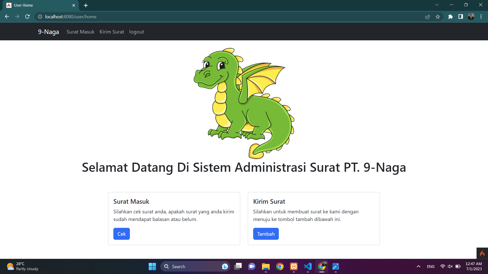
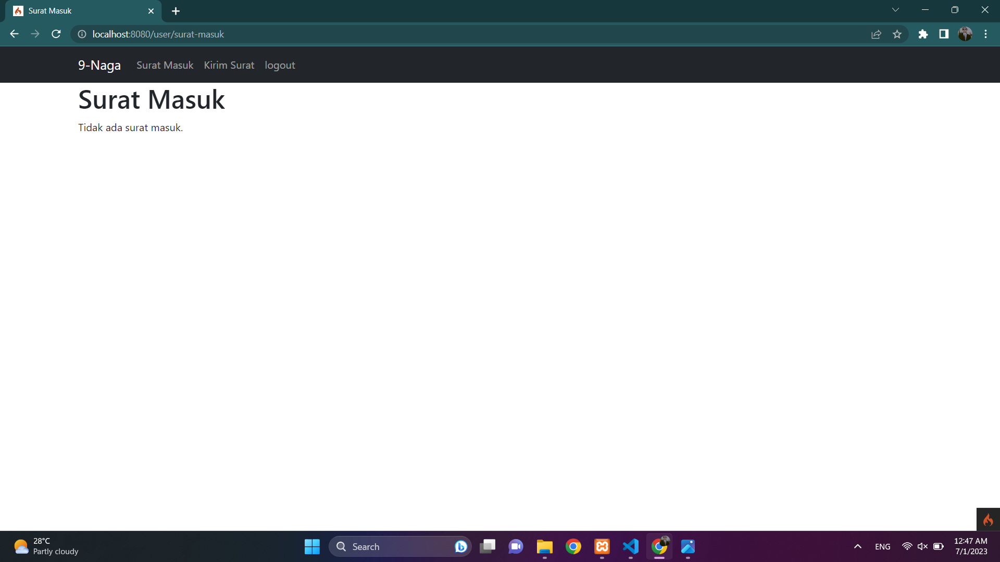
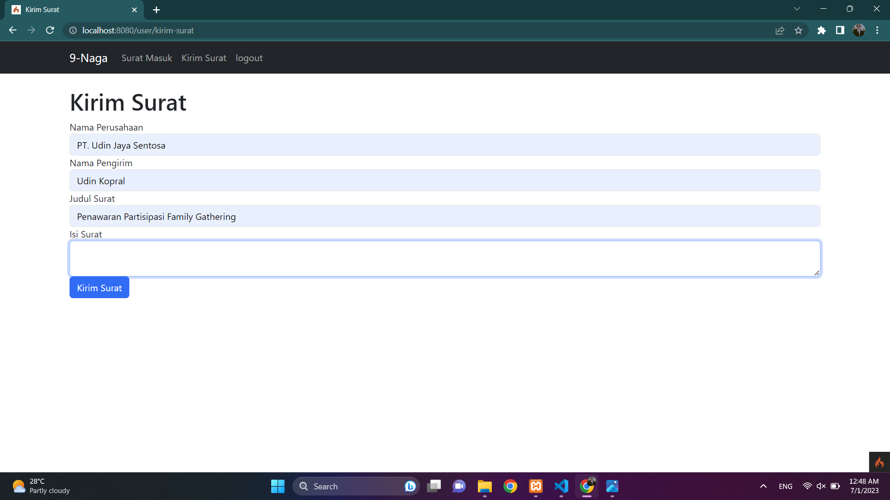

<h1 align="center">Tugas Akhir Pemrograman Web 02 - Kelompok 9</h1>

<ol>
  <li>Satrio Pratama Wijaya = Membuat Kerangka Halaman</li>
  <li>Muhamad Suryanegara = Styling Halaman Surat-Masuk Pada Sisi User</li>
  <li>Muhammad Farhan = Styling Halaman Kirim-Surat Pada Sisi User</li>
  <li>Ihsan Nurul Alam = Styling Halaman Surat Masuk Pada Sisi Admin</li>
  <li>Rovyansyah = Styling Halaman Surat Keluar Pada Sisi Admin</li>
</ol>

<h2 align="center">Sistem Administrasi Surat Masuk Dan Surat Keluar</h2>

Sistem ini memungkinkan client untuk dengan mudah mengirim surat kepada perusahaan melalui halaman "Kirim Surat". Selain itu, admin perusahaan juga memiliki akses ke halaman "Surat Masuk" yang memungkinkan mereka untuk melihat surat-surat yang dikirim oleh client. Dengan fitur ini, admin perusahaan dapat dengan cepat meninjau dan menanggapi surat-surat yang diterima. Selain itu, kami juga telah menyediakan halaman "Surat Keluar" yang memungkinkan admin perusahaan untuk mengirimkan surat balasan kepada client dengan mudah dan efisien

<h3>1. Admin</h3>

Kami telah membuat halaman admin yang dirancang khusus untuk memberikan akses yang aman dan teratur. Setelah melakukan login, admin akan diarahkan langsung ke halaman utama(admin). Halaman utama ini berfungsi sebagai titik pusat yang menyediakan navigasi yang jelas dan intuitif. Di dalamnya terdapat tautan yang mengarahkan admin ke dua halaman penting, yaitu halaman "Surat Masuk" dan halaman "Surat Keluar". Admin dapat dengan mudah mengklik tautan tersebut untuk mengakses surat masuk yang belum ditangani atau melihat riwayat surat keluar yang telah dikirim. Dengan adanya tautan ini, admin dapat dengan efisien mengelola surat-surat yang masuk dan keluar dengan cepat dan tepat.

<ul>
  <li>
    <h4>Login</h4>
    
Untuk bisa mengakses halaman home(admin), admin perlu melakukan login terlebih dahulu.

    
  </li>
  

   
  <li>
    <h4>Home (Admin)</h4>
    
Pada halaman home terdapat beberapa menu di navbar, seperti surat masuk, surat keluar, dan logout. Navbar dibuat dengan tujuan bisa memudahkan admin untuk melakukan pengelolaan surat.

    
  </li>
  

   
  <li>
    <h4>Surat Masuk</h4>
    
Pada halaman surat masuk, kami membuat tampilan untuk admin agar bisa melihat data surat yang dikirim oleh client/user.

    
  </li>
  

   
  <li>
    <h4>Surat Keluar</h4>
    
Pada halaman surat keluar, kami membuat tampilan untuk admin agar bisa mengirim ataupun membalas data surat yang dikirim oleh client/user.

    
  </li>
  

   
    <h4>Logout</h4>
    
Ketika logout diklik, maka akan langsung di tujukan ke halaman login.

  </li>
  

</ul>
<h3>2. User/Client</h3>

Kami telah membuat halaman user yang dirancang khusus untuk memberikan akses yang aman dan teratur. Setelah melakukan login, user akan diarahkan langsung ke halaman utama(user). Halaman utama ini berfungsi sebagai titik pusat yang menyediakan navigasi yang jelas dan intuitif. Di dalamnya terdapat tautan yang mengarahkan admin ke dua halaman penting, yaitu halaman "Surat Masuk" dan halaman "Kirim Surat.

<ul>
  <li>
    <h4>Login</h4>
    
Untuk bisa mengakses halaman home(user), user perlu melakukan login terlebih dahulu.

    
  </li>
  

   
  <li>
    <h4>Home (User)</h4>
    
Pada halaman home terdapat beberapa menu di navbar, seperti surat masuk, kirim surat, dan logout. Navbar dibuat dengan tujuan bisa memudahkan user untuk melakukan pengiriman dan penerimaan surat.

    
  </li>
  

   
  <li>
    <h4>Surat Masuk</h4>
    
Pada halaman surat masuk, kami membuat tampilan untuk user agar bisa melihat data surat yang dikirim oleh admin.

    
  </li>
  

   
  <li>
    <h4>Kirim Surat</h4>
    
Pada halaman kirim surat, kami membuat tampilan untuk user agar bisa mengirim  data surat ke admin.

    
  </li>
  

   
    <h4>Logout</h4>
    
Ketika logout diklik, maka akan langsung di tujukan ke halaman login.

  </li>
  

</ul>

# Kami menyadari bahwa masih banyak kesalahan pada sistem yang telah kami buat, tetapi kami akan terus berusahan untuk bisa membuat sistem yang lebih baik lagi. Terima kasih.

